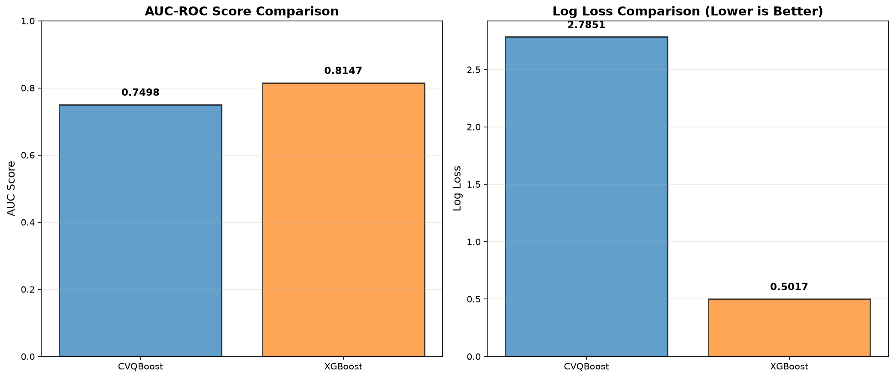
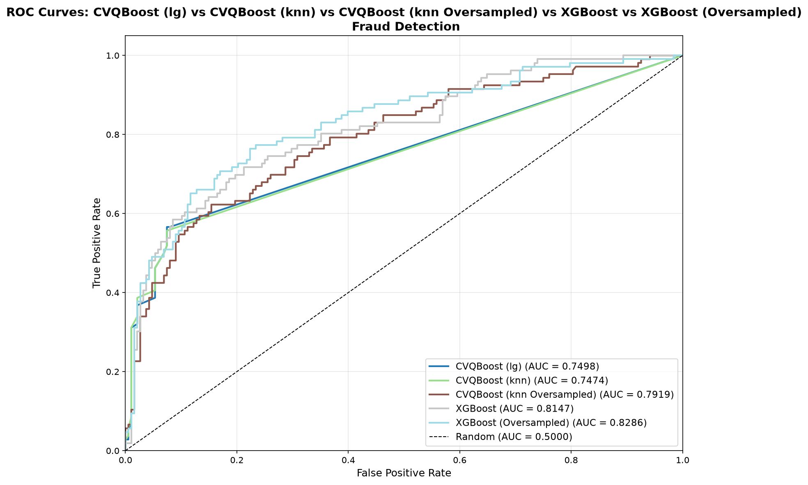
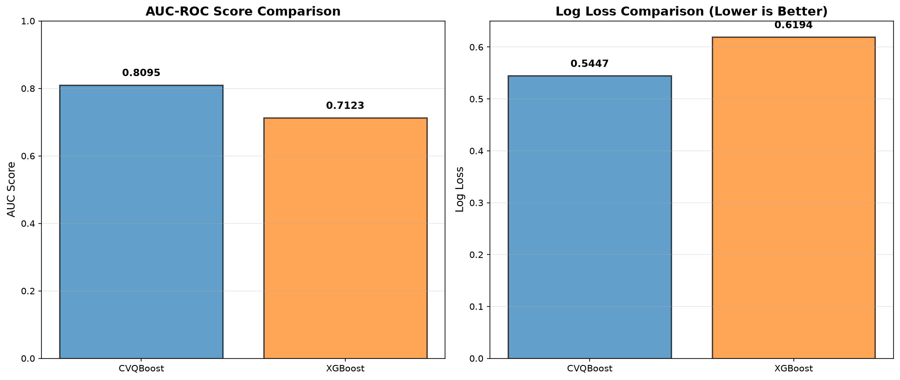
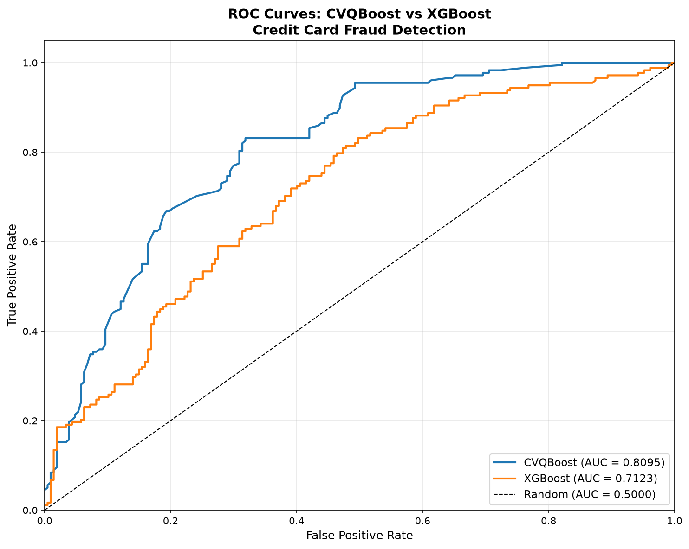

# QCI-Exploration

Tools for exploring QCi's systems including the [Dirac-3 quantum-ready optimizer](https://quantumcomputinginc.com/products/commercial-products/dirac-3).
This repository will contain various scripts for various classical and quantum
classifiers. 

Currently the repository implements scripts to compare a classical **XGBoost**
classifier against **QBoost** from QCi.


## Project structure

```
QCI-Exploration/
├── README.md
├── requirements.txt          #
├── xgboost_fraud.py          # Train/evaluate XGBoost for fraud
├── qciboost_fraud.py         # Train/evaluate QBoost on QCi Dirac-3 for fraud
├── compare_results.py        # Compare saved results across runs
└── common/
    ├── qci.py                 # QCi API client factory
    ├── logging.py              # Shared logging setup
    └── binary_classification   # Shared binary classification libraries
```

## Installation

1. Use Python 3.11+.
2. Install dependencies:

   ```bash
   pip install -r requirements.txt
   ```

3. To run `qciboost_fraud.py`, you'll also need access to a QCi Dirac-3
   account. Create a `.env` file in the project root with your credentials or
   set and environmental variables.

   ```
   QCI_TOKEN=your-api-token
   QCI_API_URL=https://api.qci-prod.com
   ```

   `qciboost_fraud.py` loads this automatically at startup.

## Preparing your data

Both scripts expect one or more CSV files containing:

- A **class/label column** identifying fraud vs. non-fraud (or true/false)
  rows. The default column name is `Class`; override it with
  `--class-override` if your dataset uses a different name (e.g.
  `FraudFound`).
- Any number of feature columns with either raw values or categories. If
  you use categories the scripts will automatically discretize via target 
  (mean) encoding. These are auto-detected and used to engineer eight additional
  `Comp_*` aggregate features (sum, min, max, avg, std, etc.).
- Optionally, an **`id` column** and any **additional feature columns**
  (e.g. `Amount`, `Time`) you'd like included as-is.

You can pass a `--train-file` only, a `--test-file` only, or both — if both
are given they're combined before the train/test split is performed
internally.

## Running the code

### XGBoost

```bash
python3 xgboost_fraud.py --train-file "./data/mlg-ulb/train.csv" --test-file "./data/mlg-ulb/test.csv"
```

### QBoost on QCi Dirac-3

> ⚠️ Each `qciboost_fraud.py` run that actually submits to Dirac-3 consumes
> paid QPU allocation (~1 QPU second, ~$0.22/run at time of writing). Use
> `--dry-run` to validate your data pipeline first without submitting a job.

```bash
python3 qciboost_fraud.py --train-file "./data/mlg-ulb/train.csv" --test-file "./data/mlg-ulb/test.csv"
```

### Comparison

```bash
python3 .\compare_results.py .\results\car_fraud\qciboost\results.json .\results\car_fraud\xgboost\results.json
```

### Using a differently-shaped dataset

Datasets that don't use the default `Class` label column, or that don't
have extra columns like `Amount`/`Time` to include, can be pointed at with
`--class-override` and `--no-additional-features`:

```bash
python3 xgboost_fraud.py --train-file "./data/car_fraud/carclaims.csv" --class-override "FraudFound" --no-additional-features
python3 qciboost_fraud.py --train-file "./data/car_fraud/carclaims.csv" --class-override "FraudFound" --no-additional-features
```

## Examples

### Binary Classification with a Tabular Credit Card Fraud Dataset

#### Data

From Kaggle: [https://www.kaggle.com/competitions/playground-series-s3e4/data](https://www.kaggle.com/competitions/playground-series-s3e4/data)

#### Results




### Vehicle Insurance Fraud Detection

#### Data

From Kaggle: [https://www.kaggle.com/datasets/khusheekapoor/vehicle-insurance-fraud-detection](https://www.kaggle.com/datasets/khusheekapoor/vehicle-insurance-fraud-detection)

#### Results



