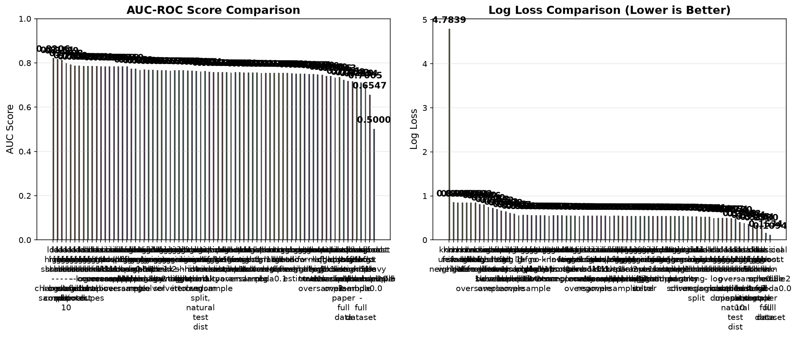
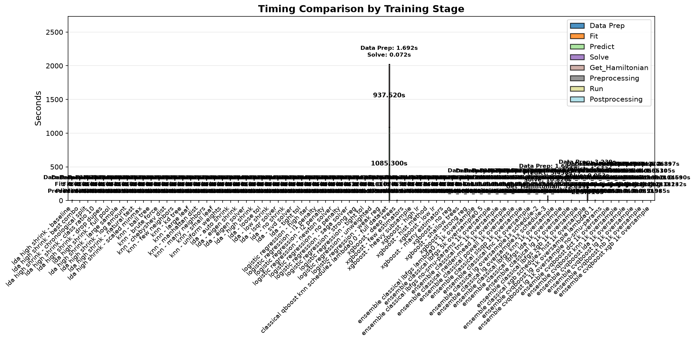

# QCI-Exploration

Tools for exploring QCi's systems including the [Dirac-3 quantum-ready optimizer](https://quantumcomputinginc.com/products/commercial-products/dirac-3).

## Quick start

1. Use Python 3.11+ and create a virtual environment (recommended).
2. Install dependencies:

```bash
pip install -r requirements.txt
```

3. (Optional) Provide QCI credentials in a `.env` file at the project root if
   you plan to submit jobs to the QCI Dirac-3 service:

```env
QCI_TOKEN=your-api-token
QCI_API_URL=https://api.qci-prod.com
```

4. Run a single experiment YAML file:

```bash
python3 ./binary_classification.py test-file tests/mlg-ulb/xgboost/default.yaml
```

5. Compare saved results:

```bash
python3 ./compare_results.py results/mlg-ulb/ensemble/classical_qboost results/mlg-ulb/ensemble/cvqboost
```

## Available Commands

### Binary Classification

#### Test File

```
 Usage: binary_classification.py test-file [OPTIONS] TEST_FILE                                                                                          
                                                                                                                                                        
 Run a single experiment from a YAML file.                                                                                                              
                                                                                                                                                        
 Args:                                                                                                                                                  
 test_file (Path): YAML file that defines the data and model configuration.                                                                             
 dry_run (bool): Validate the config and data pipeline without training.                                                                                
 display_plots (bool): Display training diagnostics and comparison plots.                                                                               
 suppress_warnings (bool): Suppress warnings during the run.                                                                                            
 save_plots (bool): Save comparison plots to disk when enabled.                                                                                         
                                                                                                                                                        
╭─ Arguments ──────────────────────────────────────────────────────────────────────────────────────────────────────────────────────────────────────────╮
│ *    test_file      PATH  [required]                                                                                                                 │
╰──────────────────────────────────────────────────────────────────────────────────────────────────────────────────────────────────────────────────────╯
╭─ Options ────────────────────────────────────────────────────────────────────────────────────────────────────────────────────────────────────────────╮
│ --dry-run              --no-dry-run                [default: no-dry-run]                                                                             │
│ --display-plots        --no-display-plots          [default: display-plots]                                                                          │
│ --save-plots           --no-save-plots             [default: no-save-plots]                                                                          │
│ --suppress-warnings    --no-suppress-warnings      [default: no-suppress-warnings]                                                                   │
│ --help                                             Show this message and exit.                                                                       │
╰──────────────────────────────────────────────────────────────────────────────────────────────────────────────────────────────────────────────────────╯
```

#### Test Folder

```
                                                                                                                                                        
 Usage: binary_classification.py test-folder [OPTIONS] TEST_FOLDER                                                                                      
                                                                                                                                                        
 Run every YAML experiment file in a folder.                                                                                                            
                                                                                                                                                        
 Args:                                                                                                                                                  
 test_folder (Path): Directory containing experiment definition files.                                                                                  
 dry_run (bool): Load and validate the configs without training models.                                                                                 
 display_plots (bool): Display any generated plots after each run.                                                                                      
 suppress_warnings (bool): Suppress warnings during the run.                                                                                            
 rerun (bool): Ignore existing result files and rerun the experiments.                                                                                  
                                                                                                                                                        
╭─ Arguments ──────────────────────────────────────────────────────────────────────────────────────────────────────────────────────────────────────────╮
│ *    test_folder      PATH  [required]                                                                                                               │
╰──────────────────────────────────────────────────────────────────────────────────────────────────────────────────────────────────────────────────────╯
╭─ Options ────────────────────────────────────────────────────────────────────────────────────────────────────────────────────────────────────────────╮
│ --dry-run              --no-dry-run                [default: no-dry-run]                                                                             │
│ --display-plots        --no-display-plots          [default: no-display-plots]                                                                       │
│ --suppress-warnings    --no-suppress-warnings      [default: no-suppress-warnings]                                                                   │
│ --rerun                --no-rerun                  [default: no-rerun]                                                                               │
│ --help                                             Show this message and exit.                                                                       │
╰──────────────────────────────────────────────────────────────────────────────────────────────────────────────────────────────────────────────────────╯
```

### Compare Results

```
 Usage: compare_results.py [OPTIONS] RESULTS_FILES...                                                                                                   
                                                                                                                                                        
 Load saved results and render the comparison plots.                                                                                                    
                                                                                                                                                        
 Args:                                                                                                                                                  
 results_files (list[Path]): JSON files or directories to compare.                                                                                      
 save_file (Path | None): Optional base name for exported plot files.                                                                                   
 display (bool): Whether to show the generated plots in a window.                                                                                       
                                                                                                                                                        
╭─ Arguments ──────────────────────────────────────────────────────────────────────────────────────────────────────────────────────────────────────────╮
│ *    results_files      RESULTS_FILES...  Paths to saved ModelResults JSON files or folders containing JSON files [required]                         │
╰──────────────────────────────────────────────────────────────────────────────────────────────────────────────────────────────────────────────────────╯
╭─ Options ────────────────────────────────────────────────────────────────────────────────────────────────────────────────────────────────────────────╮
│ --save-file                             PATH                                                                                                         │
│ --display               --no-display          [default: display]                                                                                     │
│ --install-completion                          Install completion for the current shell.                                                              │
│ --show-completion                             Show completion for the current shell, to copy it or customize the installation.                       │
│ --help                                        Show this message and exit.                                                                            │
╰──────────────────────────────────────────────────────────────────────────────────────────────────────────────────────────────────────────────────────╯
```

### QCI Status

```
 Usage: qci_status.py [OPTIONS]                                                                                                                         
                                                                                                                                                        
 Print the current QCI allocations and access state.                                                                                                    
                                                                                                                                                        
 Returns:                                                                                                                                               
 None: Logs the user-visible status for each allocation.                                                                                                
                                                                                                                                                        
╭─ Options ────────────────────────────────────────────────────────────────────────────────────────────────────────────────────────────────────────────╮
│ --help          Show this message and exit.                                                                                                          │
╰──────────────────────────────────────────────────────────────────────────────────────────────────────────────────────────────────────────────────────╯
```

### Examples

Run a single XGBoost fixture:

```bash
python3 ./binary_classification.py test-file tests/mlg-ulb/xgboost/default.yaml
```

Run all YAML fixtures in a folder (recursively):

```bash
python3 ./binary_classification.py test-folder tests/mlg-ulb/ensemble/classical_qboost
```

Compare two result folders and save exported plots/CSV:

```bash
python3 ./compare_results.py results/mlg-ulb/ensemble/classical_qboost results/mlg-ulb/ensemble/cvqboost --save-file results/mlg-ulb/comparison
```

Check QCI allocation status:

```bash
python3 ./qci_status.py
```

## Test Creation

### Test file format

Experiments are described with YAML files placed under `tests/` or provided by
users. A valid file should include the following top-level sections:

- `algorithm` (string): e.g. `xgboost`, `classical_qboost`, `cvqboost`.
- `classifier` (mapping): Algorithm-specific parameters. Can be `{}` for defaults.
- `data` (mapping): Data / preprocessing configuration. Common keys:
  - `train_file` / `test_file` (string): CSV paths. Either or both may be set.
  - `class_name` (string): Target column name (default: `Class`).
  - `index_column` (string): Optional ID/index column name.
  - `additional_feature_names` (list[string]): Columns to include as-is.
  - `engineered_feature_names` (list[string]): Aggregate feature names (pipeline will compute these if not present).
  - `model_file` (string|null): Where to save/load model artifacts.
  - `model_name_override` (string): Friendly name for saved results.
  - `test_size` (float), `random_state` (int): Split and RNG options.
  - `should_over_sample` (bool), `non_fraud_sample_size` (int), `over_sample_percentage` (float), `enforce_equal_samples` (bool): Sampling controls.

Minimal example:

```yaml
algorithm: xgboost
classifier: {}
data:
  # --- paths ---
  train_file: data\mlg-ulb\creditcard.csv
  test_file: null
  model_file: null
  index_column: id
  class_name: Class
```

The `tests/` directory contains complete example fixtures used by the
repository; use them as templates when creating new experiments.

### Data expectations

The data referenced in tests/results can be found here: https://www.kaggle.com/datasets/mlg-ulb/creditcardfraud

In general data must match the following rules:

- Input files are standard CSVs. The pipeline expects a label column (default
  `Class`) and one or more feature columns. Categorical columns are handled via
  target/mean-encoding by the pipeline.
- Optional columns such as `id`, `Time`, or `Amount` can be included and
  referenced via `additional_feature_names`.


### Outputs

- Each run produces a `ModelResults` JSON file under `results/` (path derived
  from the test filename). The JSON contains metrics, timing, and any saved
  model metadata.
- `compare_results.py` builds plots from multiple `ModelResults` files: ROC,
  PR (when available), metric comparison, and timing comparison. Use
  `--save-file` to export the plots and a CSV summary.


## Examples

### Binary Classification with a Tabular Credit Card Fraud Dataset

#### Data

From Kaggle: [https://www.kaggle.com/competitions/playground-series-s3e4/data](https://www.kaggle.com/competitions/playground-series-s3e4/data)

#### Results

This data is better viewed in excel or google sheets with this [comparison.csv](./results/mlg-ulb/comparison.csv)





